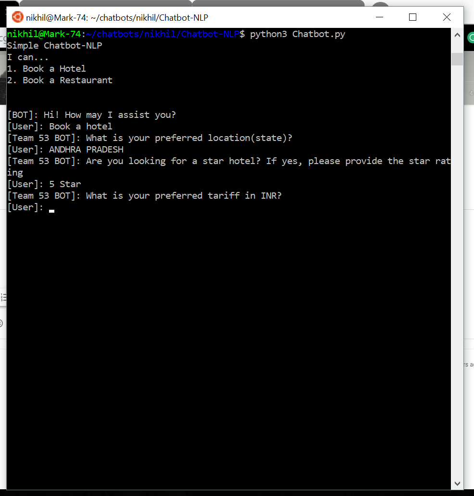
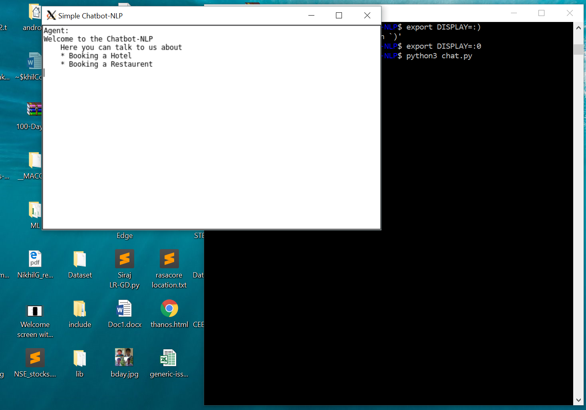

# Chatbot-NLP
A Simple Chatbot with Dialogflow architecture and skeleton

Each **Intent** has parameters which are elicted by the user for the chatbot to complete the particular Intent. Ex: City name, Restaurent name etc.,

Each **Intent** has also an action which is a funtional call after fulfilling the parameters.

Clone using **git clone https://github.com/Nikhil-Garakapati/Chatbot-NLP.git**

Run **pip install -r requirements.txt** in your shell

Then, Run **python3 Chatbot.py** 

Visit [DialogFlow](https://dialogflow.com/) and create a own chatbot to understand the architecture

**DEMO**

**EXPECTED OUTPUT**

